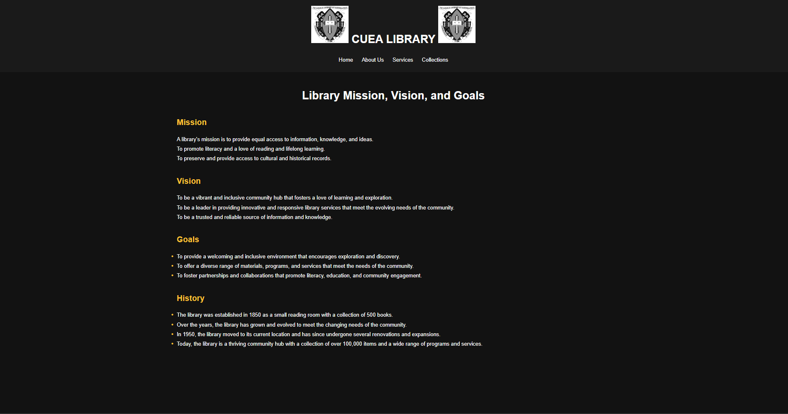
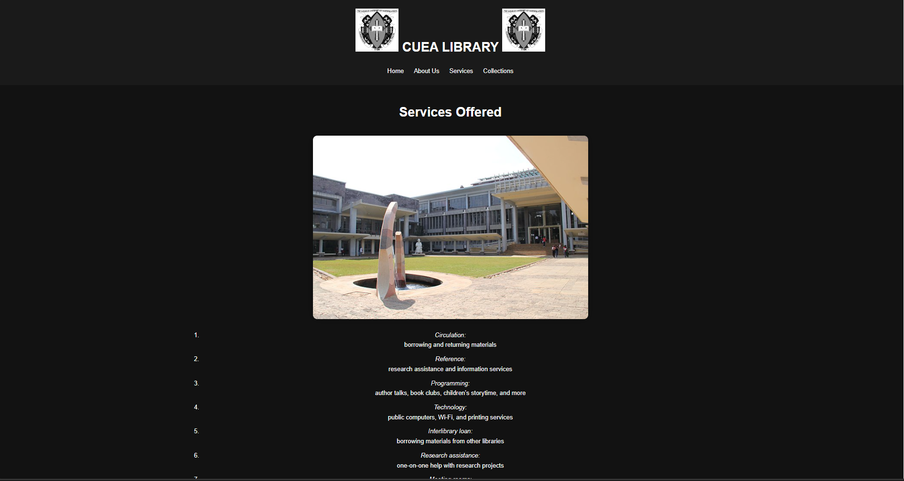
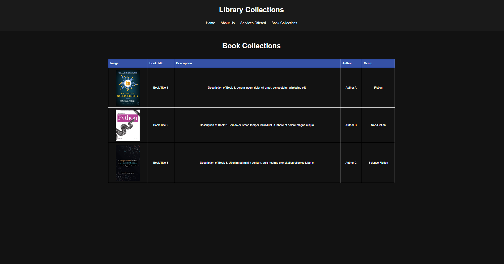

---

# Library Website

Welcome to the Library Website project! This repository contains the code and resources for a simple, user-friendly library website that allows visitors to explore our book collections, learn more about our services, and manage their accounts.

## Table of Contents

- Landing Page
- About Page
- Services Offered
- Books Available
- Installation
- Contributing
- License

## Landing Page

The landing page serves as the main entry point for users, featuring an inviting design that showcases our library's highlights. Key features include:
- **Search Bar**: Quickly find books, authors, or genres.
- **Featured Books**: A rotating selection of new and popular titles.
- **Upcoming Events**: Stay informed about upcoming library events and activities.


## About Page

The About Page provides visitors with an overview of our library's mission, history, and community involvement. It highlights our commitment to fostering a love for reading and lifelong learning.



## Services Offered

On this page, users can learn about the various services we offer, such as:
- **Book Borrowing**: Reserve and borrow physical and digital books.
- **Research Assistance**: Get help with research and reference materials.
- **Community Events**: Join book clubs, author talks, and other library-hosted events.
- **Digital Resources**: Access eBooks, audiobooks, and online databases.
  


## Books Available

This section showcases the range of books available in our library, organized by genre, author, or popularity. Users can:
- **Browse Catalog**: Explore our complete collection.
- **New Arrivals**: Discover the latest additions to our shelves.
- **Staff Picks**: Check out recommendations from our library staff.



## Installation

To set up this project locally, follow these steps:

1. Clone the repository:
   ```bash
   git clone https://github.com/yourusername/library-website.git
   ```
2. Navigate to the project directory:
   ```bash
   cd library-website
   ```
3. Install the necessary dependencies:
   ```bash
   npm install
   ```
4. Start the development server:
   ```bash
   npm start
   ```

## Contributing

We welcome contributions to improve this project! To contribute, please fork the repository, create a new branch, and submit a pull request with your changes.

1. Fork the repository.
2. Create a new branch:
   ```bash
   git checkout -b feature/your-feature-name
   ```
3. Make your changes and commit them:
   ```bash
   git commit -m "Add your feature"
   ```
4. Push to the branch:
   ```bash
   git push origin feature/your-feature-name
   ```
5. Submit a pull request.

## License

This project is licensed under the MIT License. See the LICENSE file for details.

---
